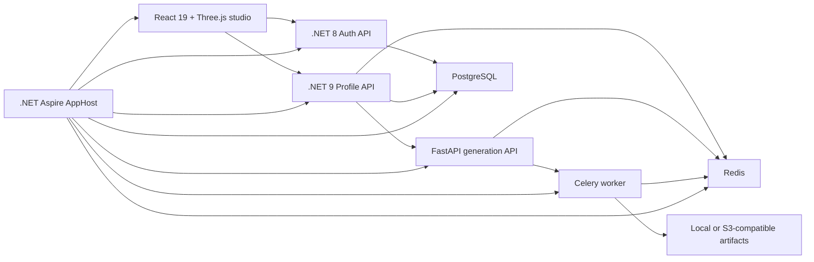

# VFR — AI-powered virtual fitting room

VFR is a multi-service virtual fitting room that turns profile measurements into interactive 3D avatar experiences. The repository combines a React studio, .NET APIs, an Aspire-managed local environment, and a Python generation pipeline built around SMPL-X.

## Architecture



## Repository map

| Component | Responsibility |
| --- | --- |
| `src/vfr-web` | React 19, Vite, Tailwind CSS, Three.js, and Zustand frontend for Studio and wardrobe flows. |
| `src/VFR.ProfileApi` | .NET 9 Minimal API for profiles, Studio drafts, generation brokering, and generated-avatar metadata. |
| `src/VFR.Auth` | .NET 8 identity, JWT, billing, administration, verification, and Telegram integrations. |
| `src/VFR.AiEngine` | FastAPI, Celery, PyTorch, and SMPL-X pipeline for avatar and garment generation. |
| `src/VFR.AppHost` | Aspire composition root for the full local service graph. |
| `tests` | Integration and cross-service API flow tests. |

## Highlights

- Parametric 3D avatar generation and GLB export
- Measurement-driven fitting with proxy anthropometric targets
- Studio draft persistence and generation status polling
- JWT-based identity, verification, billing, and administrative flows
- PostgreSQL and Redis service composition through .NET Aspire
- S3-compatible artifact storage with local-development fallbacks
- OpenTelemetry-ready service configuration
- Integration coverage across Auth, Profile API, and end-to-end HTTP contracts

## Technology

- **Backend:** .NET 8/9, ASP.NET Core Minimal APIs, EF Core, MediatR
- **Frontend:** React 19, TypeScript, Vite, Three.js, React Three Fiber, Tailwind CSS
- **AI engine:** Python 3.12, FastAPI, Celery, PyTorch, SMPL-X, Trimesh
- **Infrastructure:** .NET Aspire, PostgreSQL, Redis, Docker, S3-compatible storage
- **Testing:** xUnit, `WebApplicationFactory`, Python `unittest`

## Run locally

Requirements:

- .NET SDK `9.0.311` or a compatible newer feature band
- Docker Desktop
- Node.js 20.19+ or 22.12+

Start the complete local graph from the repository root:

```bash
dotnet run --project src/VFR.AppHost/VFR.AppHost.csproj
```

Aspire provisions PostgreSQL and Redis, builds the AI API and worker containers, starts the Auth and Profile services, and launches the Vite frontend. The Aspire dashboard exposes the generated service endpoints and logs.

Optional S3-compatible storage values can be supplied through AppHost configuration or user secrets:

```text
S3_ENDPOINT_URL
S3_ACCESS_KEY
S3_SECRET_KEY
S3_BUCKET_NAME
```

Without a configured JWT signing key, AppHost generates an ephemeral development key for the current run.

## Verify

Run the .NET test projects sequentially:

```bash
dotnet test tests/ApplicationAuth.IntegrationTests/ApplicationAuth.IntegrationTests.csproj
dotnet test tests/VFR.ProfileApi.IntegrationTests/VFR.ProfileApi.IntegrationTests.csproj
dotnet test tests/VFR.ApiFlowTests/VFR.ApiFlowTests.csproj
```

Verify the frontend:

```bash
cd src/vfr-web
npm ci
npm run lint
npm run build
```

Run the Python helper and contract tests from `src/VFR.AiEngine` after installing its dependencies:

```bash
python -m unittest discover -s tests -p "test_*.py"
```

## Configuration and current scope

See [`docs/runtime-config.md`](docs/runtime-config.md) for the runtime matrix, environment variables, and known configuration risks. The project is an active engineering prototype: deployment hardening, secret management, migration ownership, and high-fidelity body fitting remain ongoing work.

